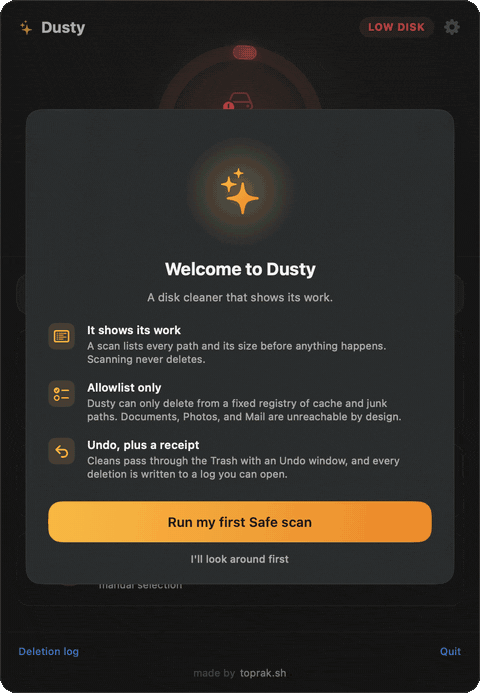

<div align="center">

# Dusty

**A macOS menu bar app that frees up disk space, without deleting anything it shouldn't.**

[](https://github.com/yagcioglutoprak/dusty/actions/workflows/ci.yml)
[](https://github.com/yagcioglutoprak/dusty/releases/latest)
[](https://www.apple.com/macos/)
[](LICENSE)



<sub>One scan, and the gigabytes hiding in caches and developer junk are laid out by size.</sub>

</div>

Dusty lives in your menu bar and shows how much disk you have free. When you are
running low, open it, scan, and reclaim the gigabytes that pile up in caches,
logs, Xcode DerivedData, simulators, and package manager folders. It shows you
every path and its size first, and it only ever deletes from a fixed allowlist.
No "clean everything" button, no surprises.

It is free, open source, and a calmer alternative to the paid cleaners.

## Install

The easy way, signed and notarized by Apple:

```bash
brew install --cask yagcioglutoprak/tap/dusty
```

Or download the latest `Dusty.dmg` from the
[releases page](https://github.com/yagcioglutoprak/dusty/releases/latest), drag
it to Applications, and open it.

Dusty appears in your menu bar as a disk icon with your free space next to it.
Prefer to build it yourself instead of downloading? See
[Build from source](#build-from-source) at the bottom.

## What it cleans

Three levels, from "do this anytime" to "look before you leap."

| Level | What it clears | Why it is safe |
| --- | --- | --- |
| **Safe** | User caches, app logs, Trash, browser caches | Regenerates on its own, zero functional impact |
| **Developer** | Xcode DerivedData, old DeviceSupport, unavailable simulators, package manager caches (npm, yarn, pnpm, pip, Cargo, Go, Homebrew, Composer, Gradle, CocoaPods, SwiftPM), JetBrains and Unity caches, optional `docker system prune` | Rebuilds or re-downloads next time you need it |
| **Deep** | Old `.dmg` / `.pkg` installers in Downloads, Xcode archives, unused simulators, aged diagnostic logs | Per-file checklist, nothing goes without a tick |

Every scan is concurrent, shows live progress, and reports the exact bytes per
target before you commit to anything.

## How it compares

The honest version, set against the paid cleaners (CleanMyMac and the like):

| | Dusty | CleanMyMac and similar |
| --- | --- | --- |
| Price | Free, MIT licensed | Paid license or subscription |
| Source code | Open, every deletion rule is readable | Closed |
| What it can delete | A fixed allowlist, nothing outside it | Broad categories, not all of them visible |
| Sizes shown before deleting | Always, per path | Varies |
| Undo and a written deletion log | Yes | Varies |
| Account or telemetry | None | Often |

## Why you can trust it

Most of the reason Dusty exists is that "Mac cleaner" usually means "app that
deletes things you cannot see." Dusty is built the other way around. The deletion
logic is a separate, fully tested Swift package (`CleanerEngine`) with no UI, and
a single component, `SafetyValidator`, is the only thing that can authorize a
delete. It enforces:

- **Allowlist only.** A path is deletable only if it descends from an explicit
  target in [`CleanupTargetRegistry`](CleanerEngine/Sources/CleanerEngine/CleanupTargetRegistry.swift).
  There is no "delete everything except" logic anywhere in the codebase.
- **Protected folders are off limits.** Documents, Desktop, Pictures, Photos
  library, Music, Movies, Mail, iCloud Drive, Keychains, and Application Support
  (except one named browser cache path) are rejected even as prefixes.
- **No symlink escapes.** Symlinks are never followed, including a symlinked
  parent directory: the path is resolved and re-checked against the allowlist, so
  a delete cannot walk out of an allowed directory.
- **Boot volume only.** Operations are confined to the volume your home folder
  lives on, and Dusty never runs as root or uses `sudo`. The only paths outside
  your home folder are the Deep level's system diagnostic logs under
  `/Library/Logs`, which need Full Disk Access. Nothing SIP-protected is touched.
- **Dry run.** Flip one toggle to scan and report without removing a thing.
- **Move to Trash and undo.** Safe cleans move to the Trash with a brief undo
  window right after, then the space is reclaimed. Developer and Deep cleans can
  also be sent to the Trash so you can recover them there yourself.
- **A written record.** Every action (timestamp, path, bytes) is appended to
  `~/Library/Application Support/Dusty/deletion-log.jsonl`.

If a permission error hits one file, that file is skipped and the run continues.

## Full Disk Access

Dusty is not sandboxed, because a sandboxed app cannot reach the caches and logs
it is meant to clean. User level paths under `~/Library` work out of the box. For
a couple of system diagnostic paths in the Deep level, macOS may ask for Full
Disk Access:

1. `System Settings` > `Privacy & Security` > `Full Disk Access`
2. Add `Dusty`
3. Reopen the app

Without it, those few paths are skipped, the rest works fine.

## Settings

- Menu bar refresh interval (default 30s)
- Dry run by default
- Move to Trash by default for Developer and Deep
- Age threshold for Deep level logs (default 30 days)

## How it is put together

```
CleanerEngine/    Swift package: scan, size, delete, safety. No SwiftUI. Unit tested.
Dusty/            SwiftUI menu bar app (MenuBarExtra) that renders the engine.
```

Keeping the engine UI free means the rules that matter are testable in isolation
and the app stays a thin layer on top. Run the tests with:

```bash
cd CleanerEngine && swift test
```

## Add a cleanup target

Targets are data, not code. One entry in `CleanupTargetRegistry.swift` and the
scanner, the UI, and the safety checks all pick it up:

```swift
CleanupTarget(
    id: "dart-pub-cache",
    displayName: "Dart and Flutter pub cache",
    level: .developer,
    pathTemplates: ["~/.pub-cache"],
    category: "Package Manager",
    deletesContentsNotDirectory: true,
    regenerates: true
)
```

Pull requests for new targets are welcome. See [CONTRIBUTING.md](CONTRIBUTING.md).

## Build from source

If you would rather build it yourself, this one line clones the repo, builds it
locally, and installs it to `/Applications`. Because the build happens on your
machine, macOS trusts it with no Gatekeeper prompts:

```bash
curl -fsSL https://raw.githubusercontent.com/yagcioglutoprak/dusty/main/scripts/install.sh | bash
```

It needs Xcode 16 or later (not just the Command Line Tools). To do it by hand:

```bash
git clone https://github.com/yagcioglutoprak/dusty.git
cd dusty/Dusty
open Dusty.xcodeproj   # then run the Dusty scheme, or:
xcodebuild -scheme Dusty -configuration Release build
```

Maintainers: cutting a notarized release is documented in
[docs/SIGNING.md](docs/SIGNING.md).

## FAQ

**Is it actually free?** Yes, MIT licensed. No trial, no upsell.

**Will it delete my projects or documents?** It cannot. Those folders are
rejected by the validator before anything is touched, and only allowlisted cache
and artifact paths are ever in scope.

**Why not the Mac App Store?** The App Store requires sandboxing, and a sandboxed
app cannot reach the caches Dusty cleans. The trade off would defeat the point.

**How is this different from `rm -rf ~/Library/Caches`?** It sizes everything
first, skips paths that are in use, can move to Trash with undo, logs what it
did, and refuses anything outside the allowlist.

## License

MIT. See [LICENSE](LICENSE).

---

<div align="center">
made by <a href="https://toprak.sh">toprak.sh</a>
</div>
