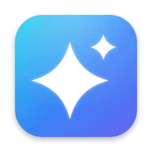
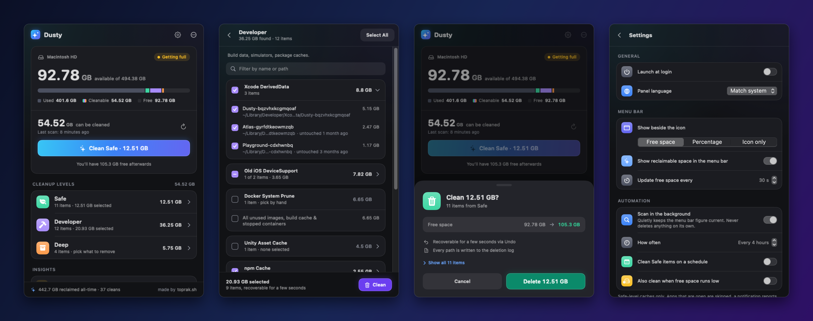

<div align="center">



# Dusty

**Mac のディスク容量を解放します。削除する前に、すべてのファイルを確認できます。**

メニューバーに常駐する、CleanMyMac の無料でオープンソースな代替アプリです。

[](https://github.com/yagcioglutoprak/dusty/releases/latest)
[](https://github.com/yagcioglutoprak/dusty/actions/workflows/ci.yml)
[](https://www.apple.com/macos/)
[](../../LICENSE)
[](https://github.com/yagcioglutoprak/dusty/stargazers)

[English](../../README.md) · [简体中文](README.zh-CN.md) · **日本語** · [Español](README.es.md) · [Français](README.fr.md) · [Русский](README.ru.md)

[**ダウンロード**](https://github.com/yagcioglutoprak/dusty/releases/latest) ·
[インストール](#インストール) ·
[クリーンアップの対象](#クリーンアップの対象) ·
[安全な理由](#安心して使える理由) ·
[コマンドライン](#コマンドラインとショートカット) ·
[よくある質問](#よくある質問)

<br>


<sub>Dusty で空き容量を確保できたら、GitHub のスターが、より安全なクリーナーを多くの Mac ユーザーに届ける助けになります。</sub>

</div>

> このページは翻訳版です。最新の内容は、常に[英語版の README](../../README.md) に反映されています。

## 概要

- **処理内容をすべて見せます。** 何かを削除する前に、すべてのパスとそのサイズを画面に表示します。スキャンで何かが削除されることはありません。
- **触れるのは不要なファイルだけです。** 削除できるのは、キャッシュや残りファイルを列挙した、内容を確認できる固定の許可リスト（allowlist）に載っているものだけです。書類、写真、メールには、設計上アクセスできません。
- **どのクリーンアップも取り消せます。** 項目はいったんゴミ箱を経由し、数秒間「取り消す」ボタンが表示されます。削除はすべてログに記録されます。
- **開発者特有の不要ファイルにも対応します。** Xcode の DerivedData、シミュレータ、npm、Cargo、pip のキャッシュ、そして忘れていたプロジェクトの `node_modules` も対象です。
- **高速です。** 実際に使っている開発マシン（M3、866 個のパスで合計約 18 GB）のフルスキャンが、約 5 秒で終わります。
- **作業の邪魔をしません。** 空き容量はメニューバーに表示され、バックグラウンドのスキャンが「クリーンアップできる容量」を常に最新に保ちます。アプリ自体も自動でアップデートされます。
- **費用はかかりません。** 無料の MIT ライセンスで、アカウント登録もテレメトリもありません。

## インストール

```bash
brew install --cask yagcioglutoprak/tap/dusty
```

または、[最新リリース](https://github.com/yagcioglutoprak/dusty/releases/latest)から `Dusty.dmg` をダウンロードし、「アプリケーション」フォルダにドラッグして開きます。どちらも署名済みで、Apple の公証を受けています。

Dusty は、ディスクのアイコンと空き容量としてメニューバーに表示されます。macOS 13 Ventura 以降が必要です。アプリは自動で最新の状態に保たれます（設定でオフにできます）。

パネルは現在、英語、フランス語、スペイン語、ロシア語に対応しています。日本語のパネルは、コントリビューターを募集しています。詳しくは [#35](https://github.com/yagcioglutoprak/dusty/issues/35) をご覧ください。

## 使い方

1. **スキャン。** ディスクのアイコンをクリックして、スキャンを実行します。Dusty はすべてのクリーンアップ対象のサイズを測り、見つかったものを 3 つのレベルに分けて、大きい順に並べます。
2. **確認。** 安全レベルはワンタップでクリーンアップできます。任意のレベルを開いて、残したい項目のチェックを 1 つずつ外すこともできます。画面下部のバーには、クリーンアップで削除される量が常に表示されます。
3. **クリーンアップ。取り消しもできます。** 確認画面には、すべてのパスと、実行前後の空き容量が表示されます。クリーンアップの後、数秒間は考え直す時間があります。「取り消す」（または ⌘Z）を押すと、クリーンアップした項目が元の場所に戻ります。

<p align="center">

</p>

## クリーンアップの対象

「いつ実行してもよいもの」から「実行前によく確認すべきもの」まで、3 つのレベルがあります。

| レベル | 削除するもの | 安全な理由 |
| --- | --- | --- |
| 🟢 **安全（Safe）** | ユーザーキャッシュ、アプリのログ、ゴミ箱、ブラウザのキャッシュ（Safari、Chrome、Firefox、Edge、Brave、Arc）、アプリのキャッシュ（Slack、Discord、Notion、Spotify、VS Code、Cursor、Signal、Obsidian、Microsoft Teams、Zoom のアップデートインストーラ、Telegram のメディアキャッシュ） | 自動で再生成され、動作への影響はありません |
| 🟣 **開発者（Developer）** | Xcode の DerivedData、古い DeviceSupport、利用できなくなったシミュレータ、パッケージマネージャのキャッシュ（npm、yarn、pnpm、pip、uv、Bun、Deno、Cargo、Go、Homebrew、Composer、Gradle、CocoaPods、SwiftPM、Dart/Flutter pub）、Cypress のバイナリキャッシュ、`~/.cache` 内の開発ツールのキャッシュ、JetBrains と Unity のキャッシュ、Maven のローカルリポジトリ（オプトイン）、`docker system prune`（任意） | 次に必要になったときに、再ビルドまたは再ダウンロードされます |
| 🟠 **ディープ（Deep）** | 「ダウンロード」フォルダ内の古い `.dmg` / `.pkg` インストーラ、Xcode のアーカイブ、使っていないシミュレータ、Time Machine のローカルスナップショット、古くなった診断ログ、Ollama のモデル（オプトイン）、放置されたプロジェクトの生成物 | チェックを入れるまで、何も選択されません |

**忘れていたプロジェクト。** ディープレベルでは、プロジェクトの中も調べます。1 か月間触れていないプロジェクトの `node_modules`、Cargo の `target` フォルダ、virtualenv を見つけ出します。そのツールのマニフェストが生成物のすぐ隣にあることが条件で、活動状況はあなた自身のファイルと git の履歴から判断します。スキャンからクリーンアップまでの間にプロジェクトに手を加えた場合、そのプロジェクトの生成物は削除されません。

**インサイト。** スキャンの後、Dusty は人が見れば気づくようなことを指摘します。たとえば、Xcode をもうインストールしていないのに残っている 12 GB の DerivedData、春から何も書き込まれていないキャッシュ、このままでは 3 週間でいっぱいになりそうなディスクなどです。インサイトは指摘するだけで、何かを選択したり削除したりすることはありません。

**おまかせモード。** バックグラウンドスキャン（デフォルトでオン、4 時間ごと）が、メニューバーの数値を最新に保ちます。このスキャンで何かが削除されることはありません。自動クリーンアップ（デフォルトでオフ）は、スケジュールに従って、または空き容量が指定したしきい値を下回ったときに実行され、パネルと同じルールに従います。

## 安心して使える理由

「Mac クリーナー」といえば、たいていは「見えないところで何かを削除するアプリ」のことです。Dusty は、その逆の考え方で作られています。削除のロジックは、UI を持たない独立した Swift パッケージ（`CleanerEngine`）にまとめられ、すべてテストされています。削除を許可できるのは、`SafetyValidator` という 1 つのコンポーネントだけです。`SafetyValidator` は次のルールを徹底しています。

- **許可リストのみ。** パスを削除できるのは、[`CleanupTargetRegistry`](../../CleanerEngine/Sources/CleanerEngine/CleanupTargetRegistry.swift) に明示された対象の配下にある場合だけです。「指定したもの以外はすべて削除する」というロジックは、コードベースのどこにもありません。
- **保護されたフォルダには触れません。** 書類、デスクトップ、ピクチャ、写真ライブラリ、ミュージック、ムービー、メール、iCloud Drive、キーチェーン、Application Support は、その配下のパスも含めて拒否されます（登録済みの対象が名指しする特定のキャッシュ用サブフォルダは除きます）。
- **シンボリックリンクで範囲外に出ることはありません。** シンボリックリンクは、親フォルダがシンボリックリンクである場合も含め、一切たどりません。
- **root では動作しません。** Dusty が root として実行されたり `sudo` を使ったりすることはなく、SIP で保護された領域には一切触れません。
- **すべてのレベルで取り消せます。** クリーンアップでは、まず項目をゴミ箱に移します。元に戻す処理も、削除と同じ方法でチェックされます。
- **ドライラン。** スイッチ 1 つで、すべてのクリーンアップが削除予定の内容を報告するだけになり、実際には何も削除しません。
- **記録が残ります。** すべての操作（日時、パス、バイト数）が `~/Library/Application Support/Dusty/deletion-log.jsonl` に追記されます。

コード付きの詳しい設計解説：[Dusty が誤った削除を防ぐ仕組み](https://toprak.sh/dusty/safety/)（英語）。許可リスト外のものを削除させる方法を見つけた場合は、非公開で報告してください。詳しくは [SECURITY.md](../../.github/SECURITY.md) をご覧ください。

## メモリ

メモリはホーム画面のディスクのすぐ下に表示されます。使用量とメモリプレッシャーに加え、使っていないアプリがメモリを占有しているときは **Free up** ボタンが現れ、確認のうえワンタップで取り戻せます。カードを開くと詳細を確認できます。

- **ありのままの状況。** 使用中のメモリをアクティビティモニタと同じ内訳（アプリ、システム、圧縮、キャッシュされたファイル）で表示し、スワップ、直近 1 時間のグラフ、そして Mac に本当にメモリが足りないかを示すメモリプレッシャーを確認できます。
- **プロセスではなくアプリ単位。** 各アプリの合計には、そのアプリのために動くすべてのプロセス（Chrome のヘルパー、Safari のページ、ターミナルから起動したツール）が含まれます。
- **使っていないアプリは最初から選択済み。** 1 時間使っていない大きなアプリを提案します。ターミナル、仮想マシン、通話中のアプリ、音声を再生・録音中のアプリは提案しません。
- **元に戻せる解放。** 一覧を確認してから、提案されたアプリをまとめて終了します。⌘Q と同じ方法で終了するため、未保存の作業があるアプリは先に確認します。数秒間は **再度開く**（または ⌘Z）で元に戻せます。
- **メモリリークも検出。** 増え続けるアプリには **再起動** ボタンが表示され、メモリを新品の状態に戻せます。

Dusty は強制終了もプロセスの kill もせず、`purge` も実行しません。`purge` には root 権限が必要で、macOS が必要に応じてすぐに返すファイルキャッシュを捨てるだけだからです。

## コマンドラインとショートカット

同じエンジン、許可リスト、安全ルールを、スクリプトからも使えます。`dusty` CLI はアプリに同梱されており、Homebrew の cask でインストールすると `PATH` に追加されます。

```bash
dusty scan                                    # 3 つのレベルすべてを計測（何も削除しない）
dusty scan --json                             # 同じ内容を機械可読な形式で出力
dusty clean                                   # 安全レベルの削除プランを表示
dusty clean --yes                             # 実際に削除する
dusty clean --level developer --trash --yes   # 開発用キャッシュをゴミ箱に移す
dusty targets                                 # 許可リスト全体を表示
dusty memory                                  # メモリ使用量、プレッシャー、上位のアプリ（読み取りのみ）
```

`clean` は、`--yes` を付けない限り何も変更しません。削除するのはアプリが自動で選択するのと同じ項目だけで、対応するアプリが起動中の対象はスキップします。ショートカットのアクション **Clean Safe Items** と **Get Reclaimable Space** を使えば、macOS のあらゆる自動化に Dusty を組み込めます。

## よくある質問

**本当に無料ですか？**
はい。MIT ライセンスで、試用期間も、有料版への誘導も、アカウントもありません。

**プロジェクトや書類が削除されることはありますか？**
いいえ。これらのフォルダは、何かに触れる前にバリデータによって拒否されます。対象になるのは、許可リストに載っているキャッシュと生成物のパスだけです。忘れていたプロジェクトでも、提示されるのはビルドで生成されたものだけで、あなたのコードが対象になることはありません。

**必要なものをクリーンアップしてしまったら？**
クリーンアップ後の数秒以内に「取り消す」（または ⌘Z）を押せば、項目は元の場所に戻ります。唯一の例外はゴミ箱を空にする操作で、Finder と同じく元に戻せません。

**なぜ Mac App Store で配布しないのですか？**
App Store ではサンドボックス化が必須ですが、サンドボックス化されたアプリからは、Dusty がクリーンアップするキャッシュにアクセスできないためです。

その他の質問（フルディスクアクセス、アップデート、ソースからのビルド）への回答は、[英語版の README](../../README.md) にあります。

## コントリビュート

プルリクエストを歓迎します。特に、新しいクリーンアップ対象と翻訳は大歓迎です。詳しくは [CONTRIBUTING.md](../../CONTRIBUTING.md) と[翻訳に関する issue](https://github.com/yagcioglutoprak/dusty/issues/33) をご覧ください。

## ライセンス

MIT ライセンスです。詳しくは [LICENSE](../../LICENSE) をご覧ください。

---

<div align="center">
制作：<a href="https://toprak.sh">toprak.sh</a>
</div>
